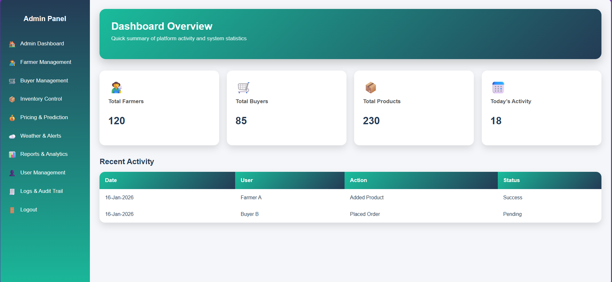
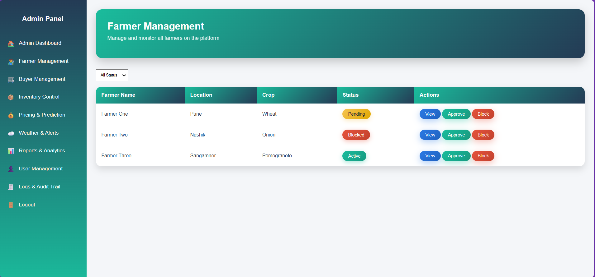
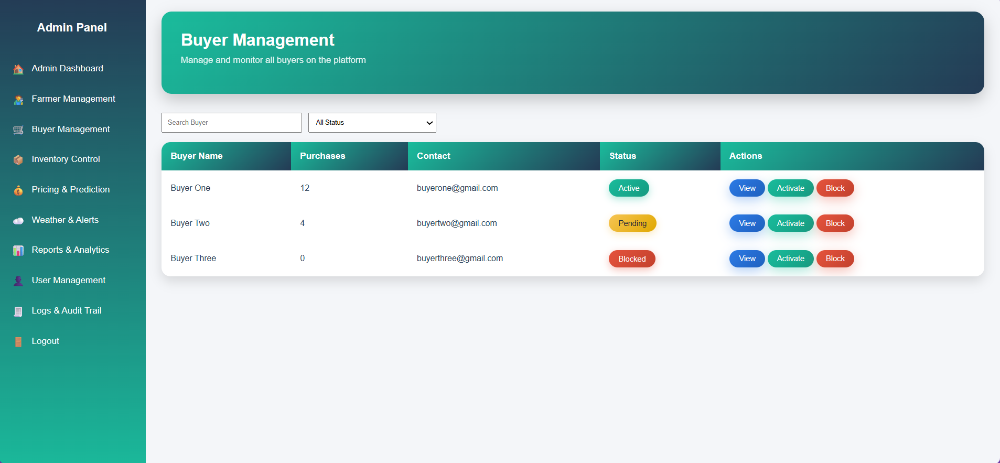
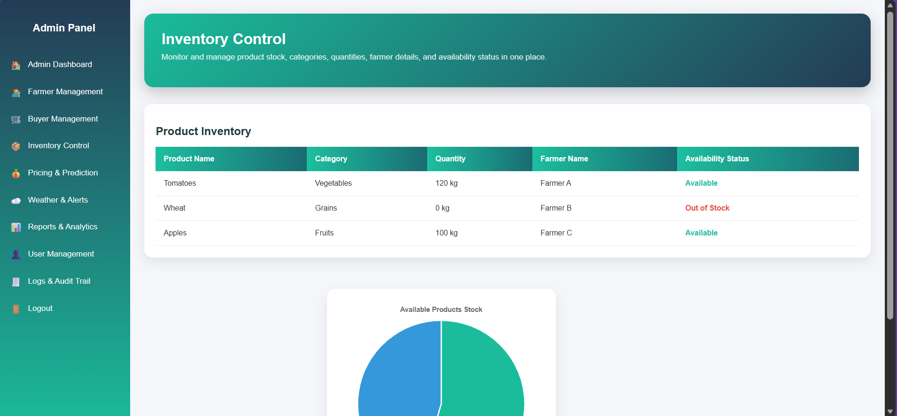
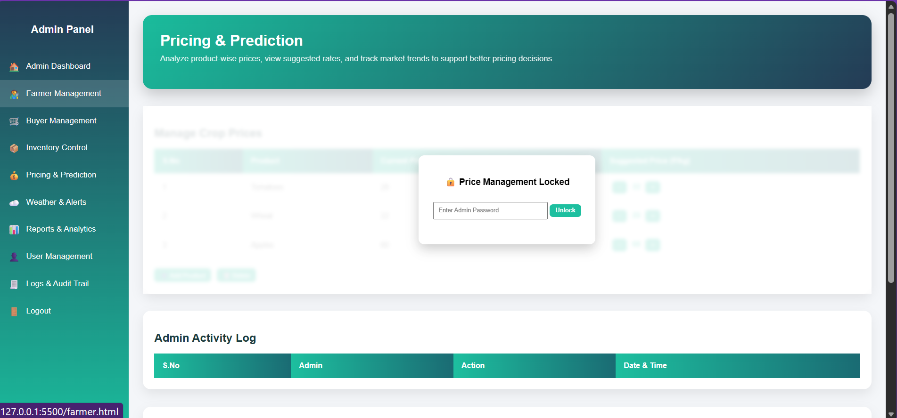
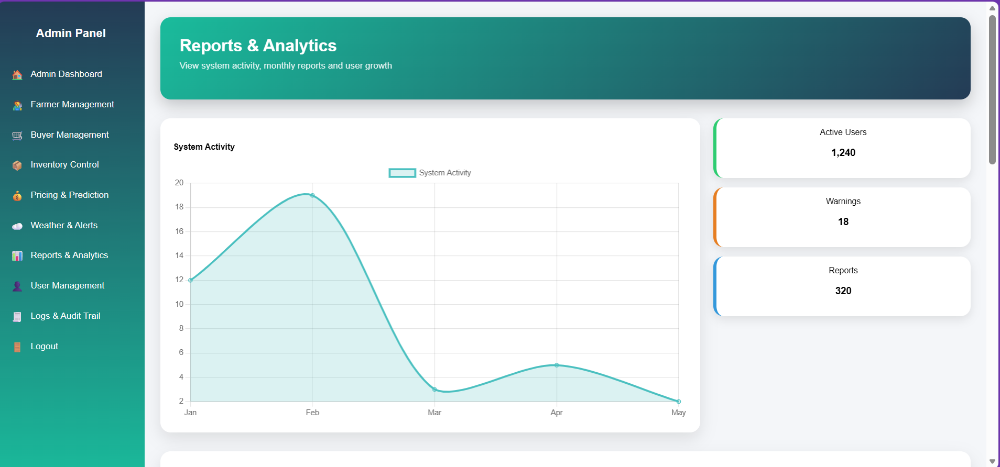
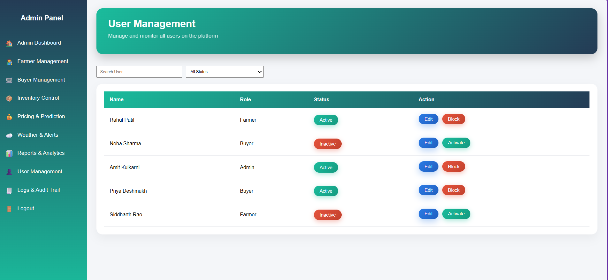
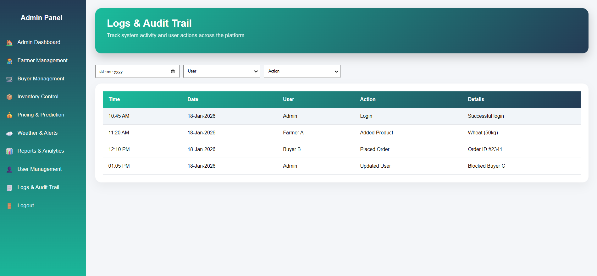

# Admin Panel

> A clean, responsive admin dashboard for managing farmers, buyers, inventory, pricing & prediction, weather alerts, reports, and users.

This project is a web-based admin panel built with **HTML**, **CSS**, and **JavaScript**.  
It provides UI interfaces for weather alerts, farmer notifications, and other administrative features for agricultural operations.

---

## 👥 Collaborators

This project is developed collaboratively with contributions :

- **Onkar Sabale**
  GitHub: https://github.com/onkarsabale
  
-  **Aditya Hase**
  GitHub: https://github.com/adiit-tya

---

### Navigation Sidebar
✔ Admin Dashboard  
✔ Farmer Management  
✔ Buyer Management  
✔ Inventory Control  
✔ Pricing & Prediction  
✔ Weather & Alerts  
✔ Reports & Analytics  
✔ User Management  
✔ Logs & Audit Trail

## 🧩 Technologies Used

| Technology | Purpose |
|------------|---------|
| HTML       | Structure of the pages |
| CSS        | Styling and layout |
| JavaScript | Client-side logic for alerts and UI interactions |
| LocalStorage | Persistent alert history (optional) |

No backend is required for this demo project; all interaction is done on the client side.

---

## 🚀 How to Run

1. Clone the repository:
   ```bash
   git clone https://github.com/onkarsabale/admin-panel.git

2. Navigate to the project folder:
    cd admin-panel

3. Open any .html file in your browser (e.g., index.html, weather.html).

Enjoy!
---

## 📸 Project Demo Screenshots

### Admin Dashboard


### Farmer Management


### Buyer Management


### Inventory Control


### Pricing & Prediction


### Weather & Alerts Module


### Reports & Analytics


### User Management


### Logs & Audit Trail


---
